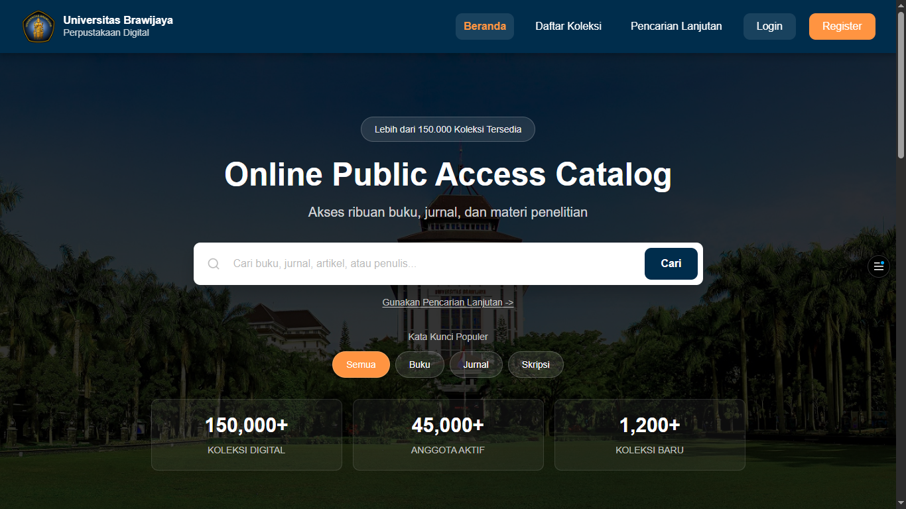

# Digilib UB Redesign

<p align="center">
  
</p>

<p align="center">
  High-Fidelity UI/UX Redesign of the Universitas Brawijaya Digital Library
</p>

<p align="center">
  
  
  
  
</p>

---

## Overview

Digilib UB Redesign is a high-fidelity redesign project of the Universitas Brawijaya Digital Library platform. The project aims to improve the overall user experience through a clearer information architecture, enhanced collection discovery, and a more intuitive search workflow.

The redesign focuses on creating a modern, accessible, and responsive interface while maintaining consistency across all major user journeys, including collection browsing, advanced search, authentication, and informational pages.

Rather than presenting static mockups, the project was implemented as a fully interactive web prototype using modern frontend technologies, allowing design decisions to be evaluated in a realistic environment.

---

## Live Demo

🔗 **https://digilib-ub-redesign.vercel.app**

---

## Features

* Homepage with collection search
* Book collection browsing
* Advanced search interface
* Login and registration pages
* About, Contact, and Help pages
* Responsive design for multiple screen sizes
* Consistent design system and reusable UI components

---

## Tech Stack

| Technology   | Purpose                    |
| ------------ | -------------------------- |
| React        | Frontend framework         |
| TypeScript   | Type safety                |
| Vite         | Development and build tool |
| Material UI  | Component library          |
| Tailwind CSS | Styling system             |
| Radix UI     | Accessible UI primitives   |

---

## Local Development

Clone the repository and install dependencies:

```bash
npm install
npm run dev
```

The development server will be available at:

```text
http://localhost:5173
```

---

## Project Structure

```text
src/
├── app/
│   ├── components/
│   └── App.tsx
├── imports/
├── styles/
└── main.tsx
```

---

## Disclaimer

This project was developed for educational and UI/UX design purposes. Collection records, book covers, and other content displayed within the application may include sample or placeholder data and do not necessarily represent the actual holdings of the Universitas Brawijaya Library.

---

<p align="center">
  Developed as part of a Digital Library Redesign Project
</p>
