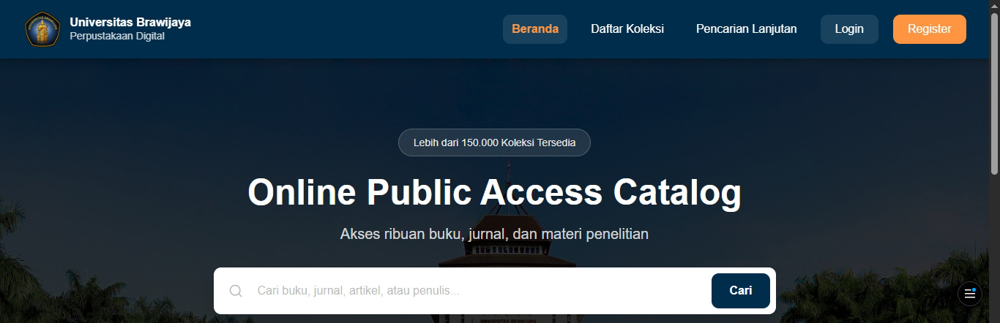

# Digilib UB Redesign

<p align="center">
  
</p>

<p align="center">
  High-Fidelity UI/UX Redesign of the Universitas Brawijaya Digital Library
</p>

<p align="center">
  <a href="https://digilib-ub-redesign.vercel.app">
    
  </a>
</p>

<p align="center">
  
  
  
  
</p>

## Overview

Digilib UB Redesign is a high-fidelity redesign project of the Universitas Brawijaya Digital Library platform. The project explores how a modern digital library experience can be achieved through improved information architecture, enhanced collection discovery, and a more intuitive search workflow.

Rather than presenting static mockups, the redesign was implemented as an interactive web prototype, allowing design decisions to be evaluated in a realistic environment. The project focuses on usability, accessibility, visual consistency, and responsive design across key user journeys, including collection browsing, advanced search, authentication, and informational pages.

## Live Demo

https://digilib-ub-redesign.vercel.app

## Key Features

The prototype includes a redesigned homepage, collection browsing interface, advanced search functionality, authentication pages, and supporting informational pages. A consistent design system and reusable UI components were developed to maintain visual coherence throughout the application while supporting multiple screen sizes.

## Technology Stack

This project was built using React, TypeScript, and Vite, with Material UI, Tailwind CSS, and Radix UI used to support component development, styling, and accessibility.

## Local Development

To run the project locally:

```bash
npm install
npm run dev
```

The development server will be available at:

```text
http://localhost:5173
```

## Disclaimer

This project was developed for educational and UI/UX design purposes. Collection records, book covers, and other content displayed within the application may include sample or placeholder data and do not necessarily represent the actual holdings of the Universitas Brawijaya Library.

<p align="center">
  Developed as part of a Digital Library Redesign Project
</p>
